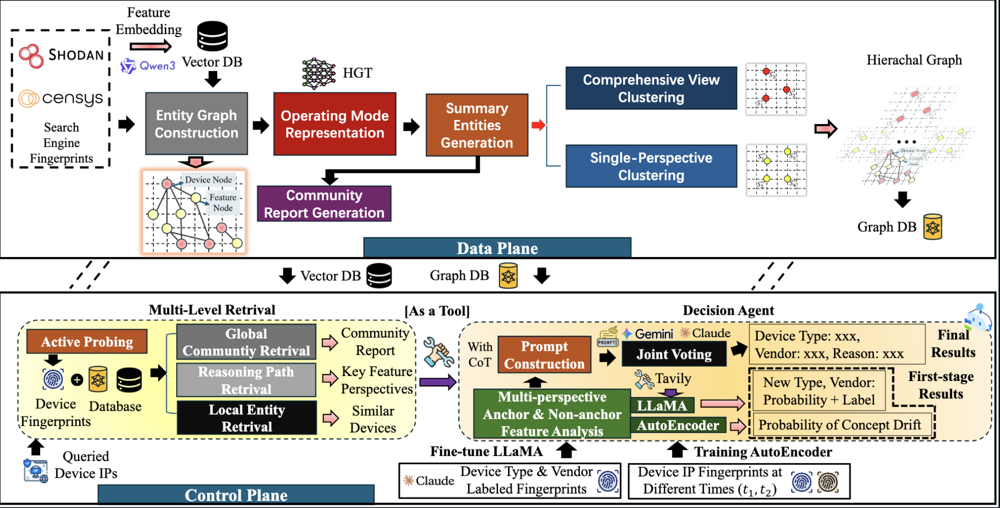

IoTProber: Internet-scale IoT Device Identification Based on Hierarchical Graph Retrieval-Augmented Generation

### Step 0. Configuration
Configure llm_config.json using your API key.

**Acquire RAG Data and Drift Data**

python acquire_data.py --collect -collect_new --filter_new --filter_old --convert --org_id <Your Org ID> --token <Your Token>
python acquire_data.py --drift

**Or You Can Download Dataset from Our Huggging Face Repository**
https://huggingface.co/datasets/IoTProber
including many large dataset that put under the folder **evaluation, platform_data, drift_data**.

**Download LLaMA 3.1-8B Instruct from the Hugging Face**
https://huggingface.co/meta-llama/Llama-3.1-8B-Instruct
Put under the folder **Meta-Llama-3.1-8B-Instruct**

**Download Qwen-3 Embedding Model from the Hugging Face**
https://huggingface.co/Qwen/Qwen3-Embedding-0.6B
Put under the folder **qwen3_embedding_06b**

### Step 1. Run RAG Hierichal Graph Construction
python graph/construction.py --hgt --cluster --build --vector --gpu 0

### Step 2. Run Decision Agent

python agent/agent.py --decompose --local --community --reasoning --decision
