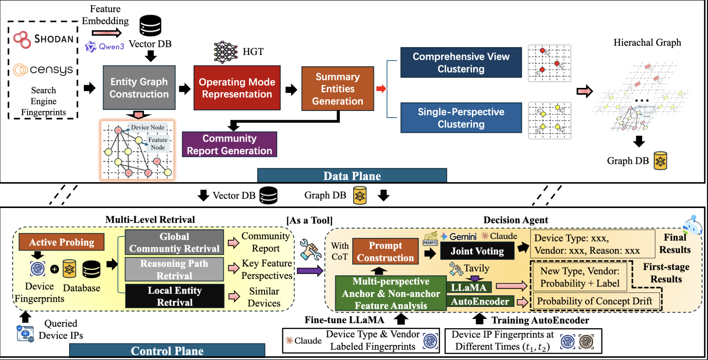

# IoTProber

**IoTProber** is a graph-based, multi-perspective IoT device identification system that combines active network fingerprinting, heterogeneous graph construction, multi-level RAG retrieval, and LLM reasoning to classify and identify IoT devices at scale.


---

## Table of Contents

- [Overview](#overview)
- [Dependencies & Environment](#dependencies--environment)
- [External Services](#external-services)
- [Configuration](#configuration)
- [Quick Start](#quick-start)
- [Memory & Speed Optimizations](#memory--speed-optimizations)
- [System Architecture](#system-architecture)
- [Directory Structure](#directory-structure)
- [Module Descriptions](#module-descriptions)

---

## Overview

IoTProber collects multi-perspective network fingerprints for IoT devices (cameras, routers, NAS, SCADA systems, etc.) via the [Censys](https://censys.io) platform, builds a hierarchical community graph, and identifies unknown devices through a multi-stage pipeline:

1. **Data Acquisition** — Pull per-device IP fingerprints from Censys (25 features across 11 perspectives).
2. **Graph & Embedding Construction** — Cluster fingerprints per perspective, summarize clusters with LLMs, and learn device-level embeddings via a Heterogeneous Graph Transformer (HGT).
3. **Multi-Level Retrieval** — For a query device, perform local vector similarity search, community-level retrieval, and reasoning-path retrieval.
4. **First-Stage Detection & Decision** — Before final classification, a first-stage gate runs **unseen-device detection** (fine-tuned LLaMA-3.1-8B; emits an independent *new-type* probability and *new-vendor* probability, each with a label or `"none"`); only when **both** probabilities are below 0.5 does it run **in-class concept-drift detection** (Perspective-Aware Contrastive Autoencoder, PACA). A multi-LLM (Gemini + Claude) voting agent then produces the final device type and vendor.

---

## Dependencies & Environment

All Python dependencies are listed in **`requirements.txt`**.

### Hardware & Memory Requirements

| Component | Minimum Configuration | Optimal Configuration |
|-----------|----------------------|----------------------|
| **GPU** | NVIDIA V100 / RTX 4070 (16 GB VRAM) | NVIDIA H800 / H100 (80 GB VRAM) |
| **System RAM** | 16 GB | 32+ GB |
| **Storage** | 500 GB SSD | 2T+ GB NVMe SSD |
| **OS** | Ubuntu 20.04+ / macOS | Ubuntu 22.04 LTS |
| **Primary use case** | Embedding + LLaMA inference, vector retrieval | Full pipeline incl. QLoRA LLaMA fine-tuning |

> **Note:** Milvus Lite loads all IVF_FLAT index vectors into memory — 16 GB RAM is the hard minimum. Milvus does not support Windows; Ubuntu or macOS is required.

### Create environment

Either conda **or** a lightweight `venv`/`uv` environment works. The environment is
named `iotprober` to keep it separate from `base`.

```bash
# Option A — conda
conda create -n iotprober python=3.10
conda activate iotprober
pip install -r requirements.txt

# Option B — venv / uv (isolated, no conda needed)
uv venv --python 3.10 --seed .venv-iotprober
uv pip install -r requirements.txt   # or: .venv-iotprober/bin/pip install -r requirements.txt
```

> **LangChain is pinned to the 0.3.x line** (`requirements.txt`). `agent/decision.py`
> uses the classic `AgentExecutor` / `create_openai_tools_agent` API, which was
> removed in LangChain 1.x — installing a 1.x release will break the decision agent.

> **GPU-only extras** (`bitsandbytes`, `torch-geometric`, RAPIDS `cuml`) are listed
> but commented out in `requirements.txt` because they cannot be pip-installed on
> macOS/arm64. Enable them on a CUDA Linux host. Without `bitsandbytes`, run the
> unseen LLaMA detector in full/half precision (`load_in_4bit=False`).

### Local model

**Download LLaMA 3.1-8B Instruct from the Hugging Face**

https://huggingface.co/meta-llama/Llama-3.1-8B-Instruct

Put under the folder **./Meta-Llama-3.1-8B-Instruct**

**Download Qwen-3 Embedding Model from the Hugging Face**

https://huggingface.co/Qwen/Qwen3-Embedding-0.6B

Put under the folder **./qwen3_embedding_06b**

The `Qwen3-Embedding-0.6B` model is required for generating 1024-dim fingerprint embeddings.

## External Services

| Service | Purpose | Config |
|---------|---------|--------|
| **Censys** (Search or Platform API) | IP fingerprint data collection | `acquire_data.py` constructor args |
| **Neo4j** | Hierarchical device knowledge graph | `bolt://localhost:7687`, default user `neo4j`, password `<Neo4j password>` (see `graph/build.py`) |
| **Milvus Lite** | Local ANN vector search | Auto-created at `platform_data/csv/local/1/vectorDB/milvus.db` |
| **Claude** (Anthropic) | LLM reasoning & decision | `llm_config.json` → `CLAUDE` |
| **DeepSeek** | LLM reasoning & decomposition | `llm_config.json` → `DEEPSEEK` |
| **Gemini** (Google) | LLM reasoning & clustering summaries | `llm_config.json` → `GEMINI` |
| **OpenAI** | Alternative LLM backend | `llm_config.json` → `OPENAI` |

---

## Configuration

### `llm_config.json`

Stores API credentials and model identifiers for all LLM backends:

```json
{
    "DEEPSEEK": { "API_KEY": "...", "BASE_URL": "https://api.deepseek.com", "MODEL": "deepseek-chat" },
    "CLAUDE":   { "API_KEY": "...", "BASE_URL": "...", "MODEL": "claude-sonnet-4-6" },
    "GEMINI":   { "API_KEY": "...", "BASE_URL": "...", "MODEL": "gemini-3.1-pro-preview" },
    "OPENAI":   { "API_KEY": "...", "BASE_URL": "...", "MODEL": "gpt-4o" }
}
```

### `perspective_info.json`

Defines the 11 fingerprint perspectives used for multi-perspective analysis, their feature columns, and retrieval weights:

| Perspective | Features | Retrieval Weight |
|-------------|---------|-----------------|
| `as` | AS number, name, BGP prefix, country | 0.03 |
| `whois` | Network/organization handle & name | 0.03 |
| `dns` | DNS reverse lookup | 0.04 |
| `body` | HTTP response body | 0.06 |
| `htags` | HTTP HTML tags | 0.06 |
| `sd` | Service port distribution | 0.10 |
| `os` | OS vendor, product, version | 0.11 |
| `sw` | Software vendors, products, versions | 0.12 |
| `hw` | Hardware vendors, products, versions | 0.16 |
| `hfavicons` | HTTP favicon URLs | 0.15 |
| `certificate` | TLS cert subjects, issuers, versions | 0.17 |

### `rag_devices.json`

Lists the 11 known IoT device types that the system is trained to identify:
`NAS`, `NVR`, `POWER_METER`, `BUILDING_AUTOMATION`, `MEDICAL`, `ROUTER`, `PRINTER`, `SCADA`, `CAMERA`, `ALARM`, `CONTROLLER`

---

### `new_devices.json`

Lists the 2 new IoT device types that the system aims to identify:
`MEDIA_SERVER`, `VPN`

---

## Quick Start

```bash
# 1. Activate the environment
conda activate iotprober          # or: source .venv-iotprober/bin/activate

# 2. Configure LLM API keys
vi llm_config.json

# 3. Acquire fingerprint data from Censys (requires Censys credentials)
python acquire_data.py --collect -collect_new --filter_new --filter_old --convert --org_id <Your Org ID> --token <Your Token>
python acquire_data.py --drift
```

**Or You Can Download Dataset from Our Huggging Face Repository including many large dataset that put under the folder **evaluation, platform_data, drift_data**.**

https://huggingface.co/datasets/IoTProber

```bash
# 4. Build the RAG hierarchical graph + vector store (Data Plane).
#    A single command runs every step in the correct dependency order:
#    cluster → build(Layer1 + entity_graph export) → HGT(+comprehensive clustering)
#            → build(Layer2/3) → vector(Milvus)
python graph/construction.py --all --gpu 0

# 5. Run the identification pipeline (Control Plane):
#    retrieval (local + community + reasoning) → first-stage (unseen + drift) → decision
python agent/agent.py --decompose --local --community --reasoning --decision
```

## Memory & Speed Optimizations

To enhance system usability and adaptability across different environments, IoTProber adopts several mechanisms to improve retrieval speed and reduce memory consumption.

### Local Entity Retrieval

- **Memory-mapped `.npy` streaming**: Each device embedding is a `1024 × 11`-dimensional vector. Loading all embeddings at once would cause memory overflow. IoTProber uses memory-mapped `.npy` files with a streaming, device-by-device access pattern, constraining peak memory within a **32 GB container limit** while still enabling exhaustive, exact similarity search over the full corpus.
- **Min-heap Top-k + argpartition pre-filtering**: A min-heap-based Top-k selection combined with `argpartition`-based pre-filtering minimises hierarchical overhead during the inner search loop.
- **Precomputed weighted L2-normalised vectors**: When all 11 perspective weights are available, each known-device embedding `E_d` is pre-transformed into

  ```
  d_stored = [w₁d₁, w₂d₂, …, w₁₁d₁₁] / ‖[w₁d₁, w₂d₂, …, w₁₁d₁₁]‖₂
  ```

  and stored once in the database. At query time the probe vector receives the same weighting and L2 normalisation, then the weighted cosine similarity score is obtained via a single inner product with `d_stored` — eliminating repeated weight multiplication at retrieval.

### Community-Level Clustering Retrieval (Milvus)

- **IVF_FLAT index with `nlist = 128`**: Perspective clustering vectors are stored in a local Milvus Lite database, one collection per perspective. The IVF_FLAT algorithm partitions the high-dimensional space into 128 clusters; queries first identify the nearest clusters, then perform exact brute-force search only within those clusters, achieving a **30–40% improvement in retrieval speed**.

## System Architecture

```
Censys API
    │
    ▼
acquire_data.py         ← Data collection (25 features / 11 perspectives)
    │
    ▼
platform_data/csv/      ← Raw per-device IP fingerprint CSVs
    │
    ▼  graph/construction.py --all   (single command, runs the steps below in order)
    │
    ├─1─► graph/cluster.py      ← Per-perspective Qwen3 embedding + HDBSCAN + LLM summaries
    │         ▼                    → embedding_{persp}/, community/single/, embedding_local/
    │
    ├─2─► graph/build.py --layer1 --export
    │         ▼                    → Neo4j Layer-1 entity graph + entity_graph/{node,relation}.csv
    │
    ├─3─► graph/HGT.py          ← Heterogeneous Graph Transformer
    │         ▼                    (entity_graph + embedding_local → hgt_embeddings/, 1024-dim)
    │     graph/cluster.py --hgt   ← Comprehensive-view clustering on HGT embeddings
    │         ▼                    → community/embedding_overall/
    │
    ├─4─► graph/build.py --layer23 ← Neo4j Layer-2 / Layer-3 community graphs
    │         ▼
    │     Neo4j (bolt://localhost:7687)
    │
    └─5─► graph/vector.py       ← Store embeddings in Milvus Lite vector DB
              ▼
         platform_data/csv/local/1/vectorDB/milvus.db

Query Device Fingerprint
    │
    ▼
agent/agent.py  (IdentificationAgent)
    │
    ├── agent/decomposition.py  ← DecompositionAgent: parse query intent → problem types
    │
    ├── agent/retrieval.py      ← MultiLevelRetrieval
    │       ├── Local retrieval      (weighted cosine similarity over Milvus vectors)
    │       ├── Community retrieval  (cluster-level LLM reasoning)
    │       └── Reasoning-path retrieval (perspective-chain LLM reasoning)
    │
    └── agent/decision.py       ← First-stage gate + multi-LLM voting (final type + vendor)
            ├── agent/unseen.py     ← UnseenDeviceDetector (LLaMA-3.1-8B + LoRA): new-type / new-vendor probs
            └── agent/drift.py      ← PACA autoencoder for in-class concept drift (run when both probs < 0.5)

agent/app.py    ← Flask REST API server (optional web interface)
```

---

## Directory Structure

```

├── acquire_data.py             # Censys data acquisition (CensysData class)
├── llm.py                      # LLM abstraction layer (Claude / DeepSeek / Gemini / OpenAI)
├── util.py                     # Shared utilities (feature loading, text processing, etc.)
├── llm_config.json             # LLM API keys, base URLs, and model names
├── perspective_info.json       # 11-perspective definitions with feature columns and weights
├── perspective_name.json       # Perspective cluster label names
├── local_used_features.txt     # 25 features used for local retrieval vectors
├── rag_devices.json            # Known IoT device type labels (9 types)
├── new_devices.json            # Candidate new device type labels
├── all_IoT_devices.json        # Broader IoT device catalogue (for unseen detection)
│
├── graph/                      # Graph construction and embedding
│   ├── cluster.py              # Multi-perspective clustering (HDBSCAN + KMeans + LLM)
│   ├── cluster_cuml.py         # GPU-accelerated clustering (NVIDIA RAPIDS cuML)
│   ├── build.py                # Neo4j hierarchical graph builder (HierarchicalGraph)
│   ├── api.py                  # Neo4j Cypher query wrapper (ProtocolGraph)
│   ├── HGT.py                  # Heterogeneous Graph Transformer for device embeddings
│   ├── vector.py               # Milvus Lite vector DB storage and indexing
│   └── metrics.py              # Evaluation metrics utilities
│
├── agent/                      # Core identification and reasoning pipeline
│   ├── agent.py                # IdentificationAgent: main entry point and workflow
│   ├── retrieval.py            # MultiLevelRetrieval: local / community / reasoning
│   ├── decomposition.py        # DecompositionAgent: query intent decomposition
│   ├── decision.py             # DecisionAgent: multi-LLM voting for final prediction
│   ├── drift.py                # PACA: concept drift detection autoencoder
│   ├── unseen.py               # UnseenDeviceDetector: LLaMA-3.1-8B unseen detection
│   └── app.py                  # Flask REST API server
│
├── evaluation/                 # Test data and evaluation results
│   ├── split_data.py           # Train/test split utility
│   ├── validation/             # Per-device test CSVs (test_{DEV}_1.csv)
│   ├── unseen/                 # Unseen device evaluation data
│   └── drift/                  # Concept drift evaluation data
│
├── platform_data/              # Raw fingerprint data fetched from Censys
│   └── csv/local/1/            # Processed CSV and embedding files
│       ├── ipraw_{DEV}.csv
│       ├── embedding_{persp}/
│       ├── community/
│       └── vectorDB/milvus.db
│
├── rag_data/                   # Legacy RAG knowledge base (fingerprint CSVs)
├── drift_data/                 # Concept drift detection outputs
├── Meta-Llama-3.1-8B-Instruct/ # Local LLaMA model weights and LoRA adapters
└── agent/query_db/             # Cached retrieval results per device per IP
    ├── local/{DEV}_local.json
    ├── community/{DEV}_community.json
    └── reasoning/{DEV}_reasoning.json
```

---

## Module Descriptions

### `acquire_data.py` — Data Acquisition
- **Class**: `CensysData`
- Connects to Censys via either the **Search API** (`uid`/`secret`) or the **Platform API** (`org_id`/`personal_access_token`).
- Collects 25 multi-perspective network features per IP: AS info, WHOIS, OS, software stack, hardware, service distribution, HTTP body/tags/favicons, TLS certificates, and DNS reverse records.
- Saves raw IP fingerprints as CSVs under `platform_data/`.

### `graph/cluster.py` — Multi-Perspective Clustering
- **Class**: `GraphClustering`
- Encodes per-perspective feature strings with the local `Qwen3-Embedding-0.6B` model (1024-dim vectors).
- Applies **HDBSCAN** (or **KMeans** fallback) to cluster devices per perspective independently.
- Sends cluster content to an LLM (Claude / DeepSeek / Gemini) to generate human-readable community summaries.
- Outputs: `embedding_{persp}/` (raw vectors), `community/single/{persp}/` (cluster summaries), `community/embedding_overall/` (concatenated 11-perspective embeddings).

### `graph/HGT.py` — Heterogeneous Graph Transformer
- Builds a Device–Feature bipartite graph from `entity_graph/node.csv` and `entity_graph/relation.csv`.
- Device nodes are initialized with the mean of 11 per-perspective embeddings (1024-dim each).
- Feature nodes are initialized with `Qwen3` embeddings of `"feature_name: value"` strings; high-degree feature nodes are penalized by `1/log(degree)`.
- Trains an **HGT** model (PyTorch Geometric) to learn final 1024-dim device representations.
- Outputs saved to `platform_data/csv/local/1/hgt_embeddings/`.

### `graph/vector.py` — Vector Database Storage
- Reads per-perspective embedding CSVs and stores them into a **Milvus Lite** local database (`vectorDB/milvus.db`).
- Creates one Milvus collection per `(perspective, device_type)` pair for efficient ANN search.
- Supports drop/resume modes for incremental updates.

### `graph/build.py` & `graph/api.py` — Neo4j Graph
- `ProtocolGraph` (`api.py`) wraps a Neo4j connection for safe Cypher queries.
- `HierarchicalGraph` (`build.py`) constructs a property graph where device nodes are connected to feature value nodes via typed relationships (e.g., `Has_as_asn`, `Has_cert_subjects`).

—————————————————————————————————————————

### `agent/agent.py` — Identification Agent (Main Entry Point)
- **Class**: `IdentificationAgent`
- Orchestrates the full identification pipeline for batch evaluation:
  1. Optional query decomposition via `DecompositionAgent`.
  2. Loads test fingerprints from `evaluation/validation/test_{DEV}_1.csv`.
  3. Calls `MultiLevelRetrieval` per IP with configurable retrieval stages.
  4. Saves results to `agent/query_db/{local,community,reasoning}/`.
- Supports `--quick_resume` mode for fault-tolerant batch execution.

### `agent/retrieval.py` — Multi-Level Retrieval
- **Class**: `MultiLevelRetrieval`
- **Local retrieval**: Computes a weighted cosine similarity between the query fingerprint vector and all stored device vectors across 11 perspectives. Returns the top-k most similar devices.
- **Community retrieval**: Feeds local retrieval candidates and the query fingerprint to an LLM for cluster-level reasoning, leveraging community summaries.
- **Reasoning-path retrieval**: Constructs a multi-hop reasoning chain across perspectives, prompting the LLM to progressively narrow down the device identity.
- Manages the Milvus vector store, embedding model (`HuggingFaceEmbeddings`), and LLM calls.

### `agent/decomposition.py` — Query Decomposition
- **Class**: `DecompositionAgent`
- Parses a free-text user query into one or more structured problem types (`DEVICE_TYPE`, `DEVICE_VENDOR`, `DEVICE_LOCATION`, `DEVICE_MODEL`, `SIMILAR_DEVICES`).
- Uses LangChain with LLM backends (Gemini / DeepSeek / OpenAI).
- Results guide which retrieval sub-tasks to activate in `IdentificationAgent`.

### `agent/decision.py` — Decision Agent
- **Class**: `DecisionAgent` (LangChain `create_openai_tools_agent`)
- Deploys two independent classification agents (Gemini + Claude) each equipped with three RAG retrieval tools (local, community, reasoning).
- Runs a **first-stage gate** before voting: unseen detection → if **both** the new-type and new-vendor probabilities are `< 0.5`, in-class concept-drift detection. The first-stage outcome is attached to each result under `first_stage` and persisted. Detectors are lazy-loaded and fail-safe (missing models degrade gracefully to voting-only). Toggle with `--no_first_stage`; supply models with `--unseen_adapter` / `--drift_dir`.
- Combines predictions by confidence-weighted voting to produce the final `device_type` and `vendor`.

### `agent/drift.py` — Concept Drift Detection
- **Class**: `PerspectiveAwareCAE` (PACA) + `DriftDetector` (single-device inference)
- Detects **in-class concept drift**: same label but shifted feature space (e.g., a camera vendor silently updates firmware).
- Uses perspective-weighted reconstruction loss + contrastive loss:
  - Non-critical perspectives (`whois`, `as`, `dns`, `sd`, `htags`, `hfavicons`, `body`) → high weight → their reconstruction error signals drift.
  - Critical perspectives (`sw`, `hw`, `os`, `certificate`) → low weight → their change more likely indicates a new device/vendor.
- Detection rule (paper): score `S(x)=Σ_p α_p·mean((x−x̂)²)`; robust threshold `τ = median(S_ref) + γ·MAD(S_ref)` (`γ=3.5`); drift iff `S(x) > τ`; per-perspective z-scores give interpretable attribution.
- `run_drift_detection()` trains PACA and persists `paca_model.pt` + `paca_artifacts.pkl` (vectorizers/scaler/threshold); `DriftDetector.detect_query_device(fingerprint)` scores a single queried device for the first-stage gate. Outputs to `drift_data/autoencoder_drift/`.

### `agent/unseen.py` — Unseen Device Detection
- **Class**: `UnseenDeviceDetector`
- Two-stage detection:
  1. **Statistical pre-screening**: extracts numerical signals from retrieval output (path match scores, similarity gaps, perspective coverage rate).
  2. **LLM reasoning**: constructs a structured prompt with key/non-key perspective data and feeds it to **LLaMA-3.1-8B-Instruct** (local, optionally 4-bit quantized) for chain-of-thought unseen detection.
- Supports **LoRA SFT fine-tuning** to adapt the base model (`evaluation/unseen/llama3/`).
- Returns **two independent probabilities** — `new_type_probability` and `new_vendor_probability` — each gated at 0.5: a probability `> 0.5` emits the concrete new type/vendor label, otherwise that field is `"none"` (insufficient evidence keeps the probability below 0.5). Also returns `is_unseen`, `confidence`, and reasoning.

—————————————————————————————————————————

### `llm.py` — LLM Abstraction Layer
- **Class**: `LLM`
- Unified interface for calling Claude (Anthropic), DeepSeek, Gemini, and OpenAI.
- Loads API keys and model names from `llm_config.json`.
- Supports single-turn `chat_with_llm()`, batch `batch_chat_with_llm()`, and JSON-mode responses.

### `util.py` — Shared Utilities
- Device label loading (`load_all_dev_labels`, `load_new_dev_labels`)
- Perspective config loading (`load_perspective_info`, `load_perspective_cluster_info`)
- Feature list loading (`load_local_used_features`)
- Vector preprocessing with weighted L2 normalization (`preprocess_vector`)
- LLM JSON output parsing (`convert_json_from_str`)
- Text chunking for embedding fallback (`chunk_text`)

---


